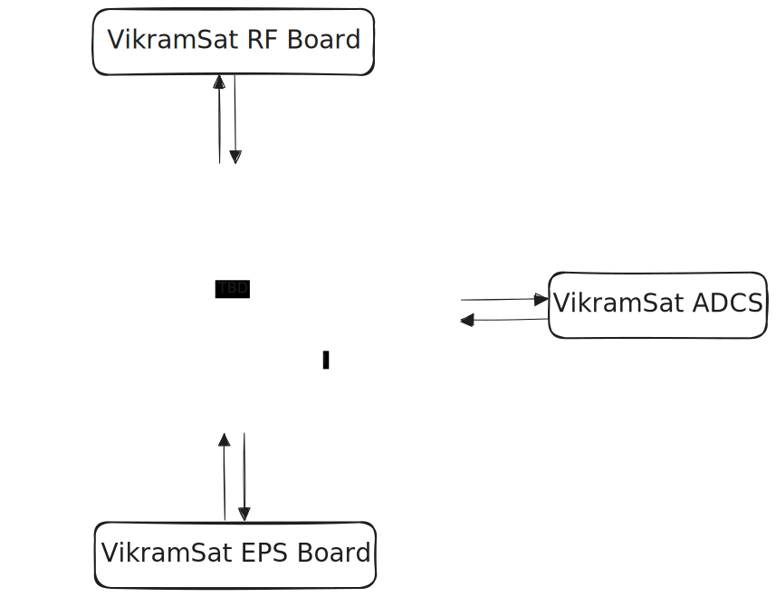

# August 3: Ready for [grounded](https://grounded.hackclub.com)!

## Day - 01
This is the first day of the project. I will be working on the Avionics Board for VikramSat. The board will be responsible for handling the communication between the VikramSat and the ground station, and all the necessary data processing.

> I am excited to start working on this project. I will be documenting my progress here. 

I have finally choosen [RPi RP2350](https://raspberrypi.com/products/RP2350) after terrible research. It has got  dual Arm Cortex-M33 core @ 150MHz and dual Hazard3 RISC-V cores. I chose ICM-20948 because of its high accuracy and low power consumption. I feel BMP390 is a good choice for pressure sensor. Here's the parts I have chosen:

|Mention| Name | Commodity | Notes |
|:----: |:----:|:---:      |:----: |
|| RP2350 | MCU | 2(Cortex-M33+RISC-V) |
|| BMP390|Pressure sensor| - |
||ICM-20948 | IMU | 9-axis IMU |

I have a prepared a block diagram. Check it out - 

<h1 align='center'>
  
</h1>

This the schematic I've prepared for today- 

<h1 align='center'>
  
</h1>

### Tasks completed today:

- [x] Chosen the MCU and other components for the Avionics Board.
- [x] Started designing the schematic.
- [x] Prepared a block diagram of the Avionics board for better idea.

### Total time spent today: 2 hours