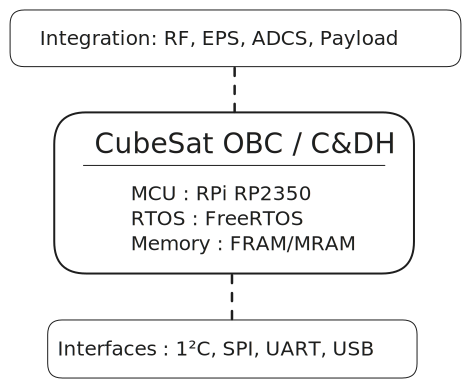

# 🛰️ CubeSat Avionics / OBC / C&DH Board

A high-reliability, low-power **On-Board Computer (OBC)** and **Command & Data Handling (C&DH)** system for VikramSat, designed for modularity, simplicity, and mission-critical operations.

> 🚀 Built for student, research, and commercial CubeSat missions.

---

## 📦 Overview

This repository contains hardware and software for the CubeSat **Avionics/OBC/C&DH subsystem**, including:

- ⚙️ Real-time telemetry and telecommand handling
- 🧠 Robust on-board computing (fault-tolerant firmware)
- 📡 Interfaces for RF, EPS, ADCS, and payload communication
- 🔒 Watchdog and fault detection mechanisms

Designed with space heritage and mission resilience in mind.

---

## 🧩 Subsystems & Features

### ✅ Key Features
- RPi RP2350 based OBC
- Redundant data buses: I2C, CAN, UART, SPI, USB
- FRAM or MRAM for persistent data storageP
- Telemetry packet generation & error checking (CRC/Checksums)
- Built-in watchdog and brownout recovery
- RTOS support (FreeRTOS)

### 📡 Interfaces
- EPS (power control, reset logic)
- [VikramSat RF subsystem](https://github.com/keyaan-07/vikramsat-rf-subsystem) (telecommand & telemetry)
- ADCS (attitude determination feedback/control)
- Payload connector (Camera)

---

## 🧠 Architecture



---

## 🛠️ Hardware

- PCB: 2 layer (FR-4)
- Components:
  - MCU: [RPi RP2350](https://raspberrypi.com/products/rp2350)
  - Memory: FRAM/MRAM (TBD)
  - Power: LDOs, and TVS/ESD protection
- Connectors: USB / Bus header / Debugger

📁 See `/hardware/` for schematics and layout (EasyEDA).

> **NOTE** : The project is under development. Hence all the components and the design may change as per the requirement.

---

## 🧪 Software

- Written in MicroPython
- RTOS support (FreeRTOS)
- Fault-tolerant state machine
- Packet parsing, command dispatcher, watchdog

📁 See `/firmware/` for source code and build instructions.

> **NOTE** : The project is under development and the software is still in its initial stages. The code may change as per the requirement.

---

## 🤝 Contributing

We welcome contributors — whether you're improving the firmware, suggesting hardware improvements, or testing!

```
# Fork, clone, and create your branch
git checkout -b feature/your-feature
```

---
## 📜 License

MIT — open-source, with mission-critical use in mind.

---

## 🧑‍🚀 Credits

Developed by Jaydev parmar

Thanks to [Hack Club](https://github.com/hackclub)

With contributions from open-source spaceflight communities 🛸


> *"Space is not the final frontier — it's just the beginning."*